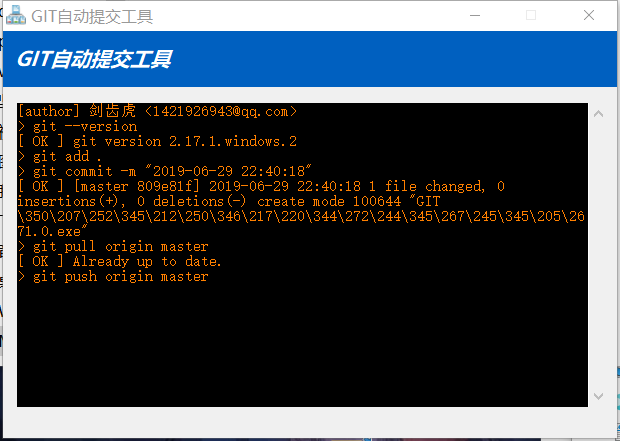
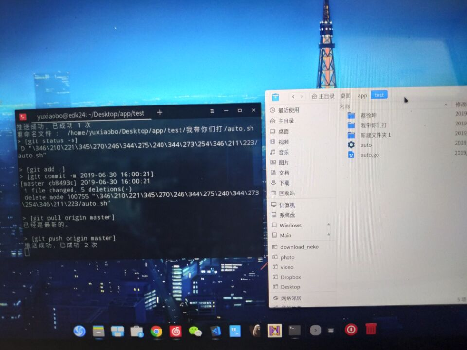

# 安装&使用说明

## 安装

如何安装? [去下载](https://github.com/edk24/git_automatic_commit/releases/latest)

## 使用 (易语言版本-windows)

- 只有一个单文件, 下载后放到你的`本地仓库目录`(与.git同级), 然后运行.

- 手动解决冲突后, 需要右键图标"我已解决冲突". 告知程序继续监听
(基于`洫蜘蛛`开源的'目录监视变化'源码开发完成)

## 使用 (go-linux版本)
- 单文件放到你的`本地仓库目录`(与.git同级), 然后运行`./auto`
- 没有gui, 为了方便观察是否出问题了. 建议在编辑器下方开个`终端`运行

# git自动提交工具
## 支持操作系统
- windows (易语言)
- linux (golang)

## 易语言版本说明

请关闭`杀毒软件`运行.  因为它会报病毒. 其实并没有病毒;

这个项目使用了一个模块, 只用到了`格式化时间`, 基于一个5a5x不知出处的`文件目录监听变化`的源码开发完成;

## golang版本说明

windows版本是给朋友做的, 自己也眼馋省事. 初识golang找个文件监控代码来改.

## 原理

主要是监听目录文件变更, 触发状态对比.  再提交推送.   比较适合三五几个人的小型团队协作开发.  比ftp协作时相互覆盖(伤害)爽多了 

> ftp多人开发可能遇到A上传代码, B下载编辑.  然后B之前的代码没有了, 被覆盖了... B决定找A打一架. 

## 初衷

做web开发什么的需要自动部署, 即时可预览. 但是`提交`真的烦.   vscode设置快捷键最快也需要两次快捷键加输入`提交信息`  

提交信息对我们小团队根本没什么卵用,  很耽误效率.

另外团队里也不是所有人都比较熟悉git, 所以很多人敬而远之.

所以我才做了这样一个工具.

**敬告** 虽然自动提交比较便捷, 但是需要团队中有熟悉git的人.  合并冲突的概率不大不代表没有.  

windows版本

linux版本

# End

**我**自己是使用Linux, 合作的哥们不会git.  这个工具是为他开发的. (之前只有windows版)  

避免被抱怨"太繁琐",  我看他用着挺顺手的,  保存代码自动提交.   看的我都眼馋想做个linux版本, 可惜不会别的编程语言了 ●﹏● (来了~ 老弟)

> go版本基于网上找来的代码, 有出处连接

> 如果有什么bug或者建议欢迎lssues.

